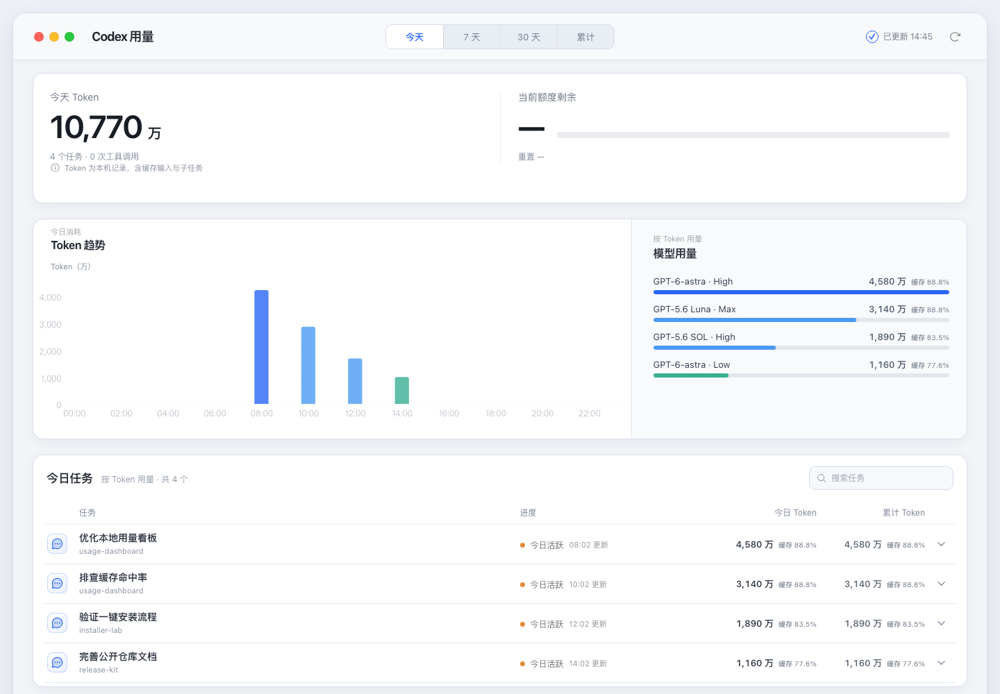

# Codex Token Usage

这是一个本地优先的 Codex 插件和 macOS 菜单栏应用，用于查看原生个人看板未展开的使用明细：

- 模型 × 思考档位 Token 构成
- 每个对话及其子任务的 Token、工具调用和持续时间
- 单个对话按“模型 × 思考档位”比较今日与本机累计 Token
- 今天、最近 7 天、最近 30 天和累计趋势
- 每个模型和任务的缓存输入占比
- 手动刷新与每天 23:59 的本地日快照

项目提供两种本地形态：可独立安装的 macOS 菜单栏 App，以及供 Codex 加载的个人插件源码。两者共用同一套本地统计逻辑，不依赖 OpenAI API Key，也不会把会话内容上传到外部服务。



## 安装

推荐在 macOS 终端中使用一条命令安装：

```bash
curl -fsSL https://raw.githubusercontent.com/JHY817/codex-token-usage/main/scripts/install-release.sh | sh
```

安装脚本会自动识别 Apple Silicon 或 Intel，校验下载文件的 SHA-256，并安装到 `~/Applications/Codex Token Usage.app`。安装后会检查本地服务和数据接口；升级失败时会恢复原版本。也可以打开 [最新版本](https://github.com/JHY817/codex-token-usage/releases/latest)，下载对应的 DMG 后拖入 Applications：

- Apple Silicon：`Codex-Token-Usage-macOS-arm64.dmg`
- Intel：`Codex-Token-Usage-macOS-x64.dmg`

GitHub Release 已内置 Node.js 运行时，使用者不需要另行安装 Node.js。需要 macOS 13+，并且本机已经使用过 Codex。应用会自动查找常见安装位置以及 ChatGPT/Codex App 内置的 `codex` 命令；仍未找到时，本地 Token 看板可用，但官方剩余额度不可用。

> 当前公开的 v0.1.4 安装包尚未使用 Apple Developer ID 签名和公证，首次打开可能需要在“系统设置 → 隐私与安全性”中确认。后续稳定版发布流程已改为强制签名和公证；缺少凭据时只允许手动构建预览产物，不会创建稳定 Release。

## 数据口径

插件只读扫描 `CODEX_HOME/sessions` 与 `CODEX_HOME/archived_sessions`。Token 增量取自 `token_count.total_token_usage` 的相邻差值，模型和档位取自当时最近的 `turn_context`。显式子任务会归入父对话；启动阶段的父历史回放会被排除。守护与自动审查任务只显示安全汇总标题。

“累计”范围覆盖当前仍保留的本机会话日志，从最早可归因的 `token_count` 事件统计到当前本地日期，不代表官方账单。首次打开累计范围会建立 SQLite 中的 rollout 文件聚合索引；后续只检查文件路径、大小和修改时间，仅重新解析新增或变化的文件，并清理已删除文件的索引。索引只保留按本地日期、模型和思考档位聚合的 Token、任务元数据和安全项目短名，不保存提示词、回复或完整 cwd。

任务列表聚焦任务、进度、Token 和项目，不重复展示模型字段。“今天”、7 天和 30 天范围会并列显示周期 Token 与本机累计 Token；累计值通过一次批量读取补齐，不会逐行重复扫描历史记录。“累计”范围只保留一个累计列，避免重复。展开任务后进入详情，可在同一尺度的横向条形图中比较该任务各个“模型 × 思考档位”的今日消耗与本机累计消耗；较浅的底条表示累计，实心前景条表示今日。这里的累计同样只覆盖当前仍保留的本机会话日志。

这些数据是“本地可归因使用”，不是账单，也不保证与 Codex 原生个人信息页的日总量逐日完全一致。

“缓存 xx%”表示 **缓存输入 Token ÷ 输入 Token**，不是请求次数命中率。缺少缓存字段或输入为 0 时显示 `—`。

看板会明确显示数据状态：

- `本地实时归因`：刚刚扫描本机事件所得
- `本地快照`：读取同一统计周期已保存的快照
- `数据读取失败`：真实数据不可用；不会自动回退成演示数据

插件介绍中的截图由合成会话生成，仅用于展示界面样式，不代表任何真实账户数据。

完整的任务标题、项目名和会话明细只用于本地界面。Codex 插件工具返回给模型的内容仅包含匿名汇总，界面明细通过 MCP 结果的私有 `_meta` 传递。

## 从源码开发

```bash
git clone https://github.com/JHY817/codex-token-usage.git
cd codex-token-usage
npm install
npm --prefix ui install
npm run check
```

本地开发预览通过 `http://127.0.0.1:4173/` 打开，并直接读取真实本机事件；统计周期可切换为今天、7 天、30 天或累计。开发服务只监听回环地址，不向局域网开放。

## macOS 菜单栏 App

菜单栏 App 是一个本地原生小应用：状态栏只显示 Codex 图标、额度用量条和已用百分比；点击后展示额度窗口、重置倒计时、今日 Token 与本地同步状态，“打开详情”会在原生窗口中加载本地看板。额度只通过本机 `codex app-server` 的 `account/rateLimits/read` 读取，不会启动模型回合，也不会用本地 Token 推算额度。

在 macOS 上构建并安装到用户级 Applications 目录：

```bash
npm run native:install
```

构建并安装后立即启动：

```bash
npm run native:install:launch
```

只构建开发包（产物为 `dist/macos/Codex Token Usage.app`），或卸载已安装的 App：

```bash
npm run native:build
npm run native:uninstall
```

本地开发包需要 Node.js 22+；GitHub Release 会携带 Node.js 运行时。菜单栏 App 和本地宿主只绑定 `127.0.0.1`，卸载不会删除 `~/.codex/token-usage-insights` 中的快照。

MCP 服务通过 `.mcp.json` 以 stdio 启动。前端生产资源由服务端以内联 MCP App Resource 返回，不依赖外网资源。

## 每日快照

定时任务默认不自动写入系统。确认后可安装每天 23:59 执行的 macOS `launchd` 任务：

```bash
npm run scheduler:install
```

停用任务但保留历史快照：

```bash
npm run scheduler:uninstall
```

也可以通过 CLI 手动生成累计快照：

```bash
node server/cli.mjs refresh all
```

## 维护与发布

日常更新：

```bash
git pull --rebase
npm run check
git add .
git commit -m "feat: describe the change"
git push
```

发布新版本：

```bash
npm run release:prepare -- 0.2.0
git add .
git commit -m "release: v0.2.0"
git tag v0.2.0
git push origin main --follow-tags
```

版本标签会触发 GitHub Actions，自动测试并生成 Apple Silicon、Intel 的 ZIP/DMG 和 SHA-256 校验文件。签名和公证配置见 [发布指南](docs/RELEASING.md)。

## 贡献、安全与许可

提交修改前请阅读 [CONTRIBUTING.md](CONTRIBUTING.md)。安全问题请按 [SECURITY.md](SECURITY.md) 私密报告。项目使用 [MIT License](LICENSE)，第三方图标声明见 [macos/THIRD_PARTY_NOTICES.md](macos/THIRD_PARTY_NOTICES.md)。

Codex、OpenAI 及其标志是其各自权利人的商标。本项目是社区工具，与 OpenAI 没有隶属或官方背书关系。
